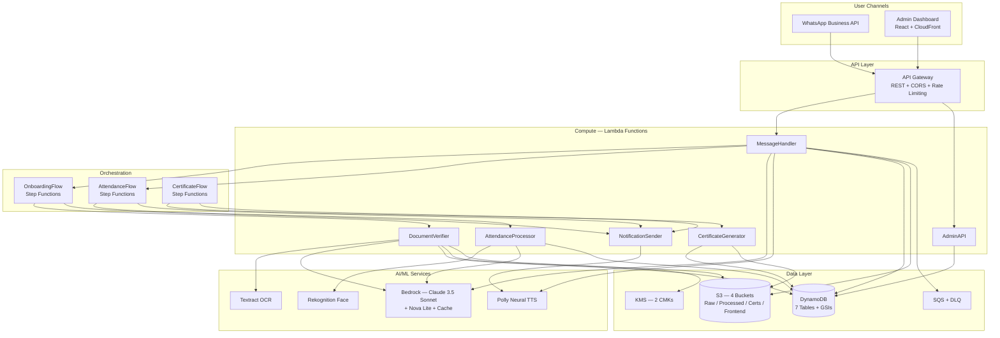

# Nirman Mitra

**AI Techno-Legal Concierge for Construction Worker Welfare**

Built 100% on AWS | Voice-First | Zero Literacy Required | 9 Languages

> **AI for Bharat Hackathon 2026** — AWS x Hack2skill | Student Track

---

## The Problem

India's 71 million construction workers are locked out of **Rs 38,000 Crore** in welfare benefits because they cannot prove 90 days of work — a requirement that contractors routinely sabotage by refusing documentation.

| Metric | Reality |
|---|---|
| Registered construction workers | 71 million across 35 state/UT boards |
| Workers receiving benefits | < 20% of eligible workers |
| Application rejection rate | 87% due to name mismatches |
| WhatsApp penetration | 95%+ among construction workers |

## The Solution

Nirman Mitra ("Builder's Friend") is a voice-first AI concierge on WhatsApp. A worker sends a selfie and voice note daily — after verified days, they receive an auto-generated, legally valid Smart Certificate with **zero typing, zero app downloads, and zero literacy required**.

### Core Innovation: Triple Verification

Every attendance log is verified through three independent AI channels simultaneously:

| Channel | AWS Service | What It Catches |
|---|---|---|
| **Face Match** | Amazon Rekognition | Buddy-punching, fake identities |
| **Geo-Fence** | GPS + Site matching | Off-site check-ins, spoofing |
| **Voice Intent** | Amazon Bedrock (Claude) | Fake check-ins, scripted messages |

All three processed in < 5 seconds via Step Functions parallel branches.

### The Four Zeros

| Principle | How |
|---|---|
| **Zero Literacy** | Voice-first via WhatsApp voice notes + Polly TTS |
| **Zero Downloads** | WhatsApp only — no app installation |
| **Zero Contractor Dependency** | AI self-verification replaces employer sign-off |
| **Zero Typing** | Voice input + camera — no text entry |

## Architecture



### Deliberate Architectural Decisions

| Decision | Choice | Why Not Alternative |
|---|---|---|
| **Database** | DynamoDB (7 tables) | RDS adds VPC cold starts + fixed cost; DynamoDB scales to zero |
| **Compute** | Lambda (6 functions) | EC2/ECS adds idle cost; Lambda auto-scales per request |
| **Orchestration** | Step Functions | SQS chains lose state; SF gives visual debugging + parallel branches |
| **LLM** | Bedrock Claude 3.5 Sonnet | SageMaker endpoints cost $0.7/hr idle; Bedrock is pay-per-token |
| **Light LLM** | Amazon Nova Lite | 85% cheaper than Sonnet for voice transcription; same Bedrock API |
| **Caching** | DynamoDB BedrockCache + TTL | ElastiCache adds VPC + fixed cost; DynamoDB TTL is free |
| **Frontend** | S3 + CloudFront | Amplify Hosting adds build minutes cost; S3+CF is free tier eligible |
| **Region** | ap-south-1 (Mumbai) | Lowest latency for Indian users; CloudFront serves globally anyway |

### Cost Analysis

| Component | Monthly Cost (10K workers) | Optimization |
|---|---|---|
| Bedrock Claude 3.5 | ~$45 | Cache reduces repeat calls by ~70% |
| Bedrock Nova Lite | ~$3 | Used for transcription (85% cheaper) |
| DynamoDB | ~$5 | PAY_PER_REQUEST, no provisioned capacity |
| Lambda | ~$2 | 512MB, 30s timeout, scales to zero |
| S3 + CloudFront | ~$1 | Frontend in free tier for low traffic |
| Rekognition | ~$10 | 1 CompareFaces per attendance |
| Textract | ~$5 | Only during onboarding (2 docs/worker) |
| **Total** | **~$71/month** | **$0.007 per worker/month** |

### 16 AWS Services

| Service | Role |
|---|---|
| Amazon Bedrock (Claude 3.5 + Nova) | Conversational AI, intent extraction, name cross-validation |
| Amazon Polly | Neural TTS in 9 Indian languages |
| Amazon Textract | OCR for Aadhaar, PAN, bank passbooks |
| Amazon Rekognition | Facial verification + liveness detection |
| Amazon S3 | 4 buckets: raw (90d), processed (7yr), certificates, frontend |
| Amazon DynamoDB | 7 tables with GSIs and auto-scaling |
| AWS Lambda | 6 functions with X-Ray tracing |
| AWS Step Functions | 3 workflows with parallel AI processing |
| Amazon SQS | Retry queues with backoff + DLQ |
| Amazon API Gateway | REST APIs with rate limiting and validation |
| AWS KMS | Dedicated CMKs for Aadhaar encryption |
| Amazon CloudFront | Global CDN for admin dashboard (SPA) |
| Amazon CloudWatch | Alarms + structured logging |
| AWS X-Ray | End-to-end distributed tracing |
| AWS IAM | Least-privilege roles per Lambda function |
| AWS CloudFormation (SAM) | Infrastructure as Code — single `template.yaml` |

## Quick Start

### Prerequisites

- Node.js 20+
- AWS SAM CLI
- AWS CLI v2 (configured with credentials)

### Deploy Backend

```bash
# Install dependencies
npm install

# Build and deploy
sam build
sam deploy --guided
```

### Deploy Frontend

```bash
cd admin-dashboard && npm install && cd ..

# Automated deploy (reads stack outputs automatically)
chmod +x scripts/deploy-frontend.sh
./scripts/deploy-frontend.sh nirman-mitra-stack ap-south-1
```

Or manually:

```bash
cd admin-dashboard
VITE_API_URL=https://<api-id>.execute-api.ap-south-1.amazonaws.com/dev npm run build
aws s3 sync dist/ s3://<frontend-bucket> --delete
aws cloudfront create-invalidation --distribution-id <id> --paths "/*"
```

### Seed Demo Data

```bash
node demo/seed-demo-data.js
```

### Local Development

```bash
# Backend (SAM local)
sam local start-api --port 3001

# Frontend (Vite dev server)
cd admin-dashboard && npm run dev
```

### Demo Mode for Judges

The project runs in demo mode by default (`ENVIRONMENT=dev`):
- **Pre-seeded data**: 10 workers, 3 construction sites, 30 attendance logs
- WhatsApp API calls are mocked to console
- Certificate threshold: **3 days** (instead of 90) — easy to trigger
- GPS defaults to New Delhi coordinates
- Dashboard charts display real data from DynamoDB

To explore:
1. Open the CloudFront URL in an incognito browser
2. Dashboard shows live stats, confidence charts, and site breakdown
3. Review Queue shows flagged attendance logs for admin action
4. Worker Search lets you browse all registered workers
5. Certificate Verify accepts SHA-256 hashes from QR codes

## Project Structure

```
nirman-mitra/
  src/
    handlers/           # 6 Lambda function entry points
    services/           # Business logic (voice, OCR, registration)
    utils/              # Shared utilities (DynamoDB, S3, KMS, Bedrock client)
    stepFunctions/      # 3 Step Functions ASL definitions
  admin-dashboard/      # React + Vite admin UI
  demo/                 # Test scripts and demo data
  scripts/              # Deploy and setup scripts
  template.yaml         # AWS SAM template (16 services)
  tasks.md              # Implementation checklist
  design.md             # System design specification
```

## Security & Privacy

- **Aadhaar Act compliant**: KMS encryption, binary storage only, last 4 digits masked
- **DPDP 2023 ready**: Explicit consent, deletion rights, PII audit logging
- **TLS 1.3** on all data in transit
- **Least-privilege IAM**: Separate roles per Lambda function
- **CloudTrail**: All PII access logged
- **S3 public access blocked** on all buckets (CloudFront OAC for frontend)

## Impact

| SDG | Contribution |
|---|---|
| SDG 1 - No Poverty | Unlocks Rs 38,000 Cr in welfare benefits |
| SDG 8 - Decent Work | Creates verifiable employment records |
| SDG 10 - Reduced Inequalities | Voice-first includes illiterate workers |
| SDG 16 - Strong Institutions | Digitizes BOCW boards, reduces fraud |

## Team

**Nirman Mitra Team** | AI for Bharat Hackathon 2026

## License

MIT
